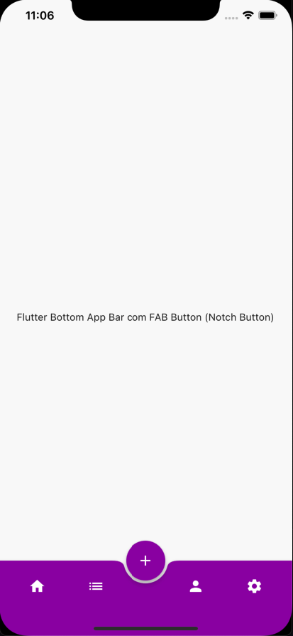

# Menu
 
Flutter Bottom App Bar com FAB Button (Notch Button)





Codigo simples
```dart

  return Scaffold(
      body: const Center(
        child: Text(
          'Flutter Bottom App Bar com FAB Button (Notch Button)',
        ),
      ),
      extendBody: true,
      floatingActionButtonLocation: FloatingActionButtonLocation.centerDocked,
      floatingActionButton: FloatingActionButton(
        backgroundColor: Colors.purple,
        onPressed: () {},
        child: const Icon(
          Icons.add,
          color: Colors.white,
        ),
      ),
      bottomNavigationBar: BottomAppBar(
        shape: const CircularNotchedRectangle(),
        color: Colors.purple,
        child: IconTheme(
          data: const IconThemeData(
            color: Colors.white,
          ),
          child: Padding(
            padding: const EdgeInsets.all(12.0),
            child: Row(
              mainAxisAlignment: MainAxisAlignment.spaceAround,
              children: [
                IconButton(icon: const Icon(Icons.home), onPressed: () {}),
                IconButton(icon: const Icon(Icons.list), onPressed: () {}),
                const SizedBox(
                  width: 24,
                ),
                IconButton(icon: const Icon(Icons.person), onPressed: () {}),
                IconButton(icon: const Icon(Icons.settings), onPressed: () {}),
              ],
            ),
          ),
        ),
      ),
    );
    ```

